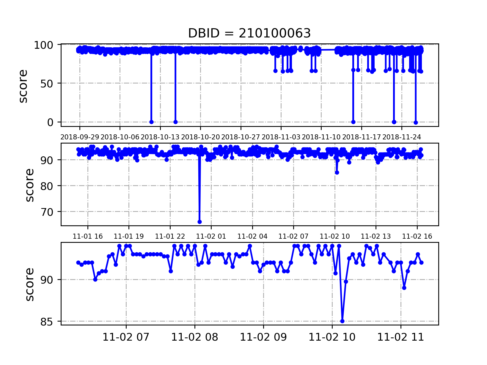
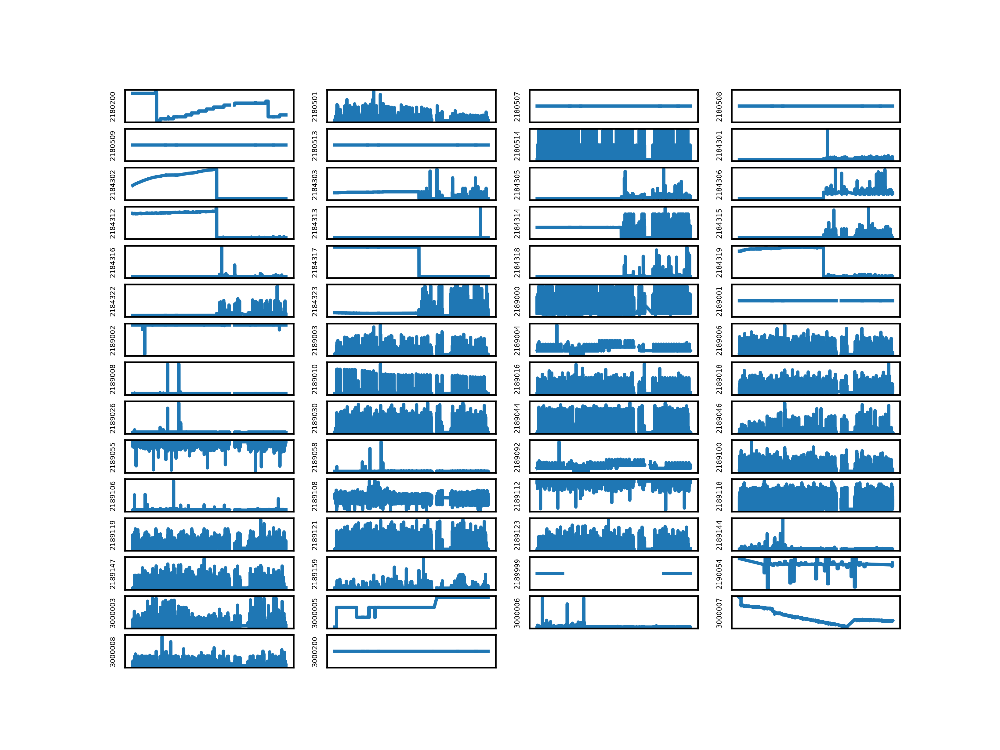
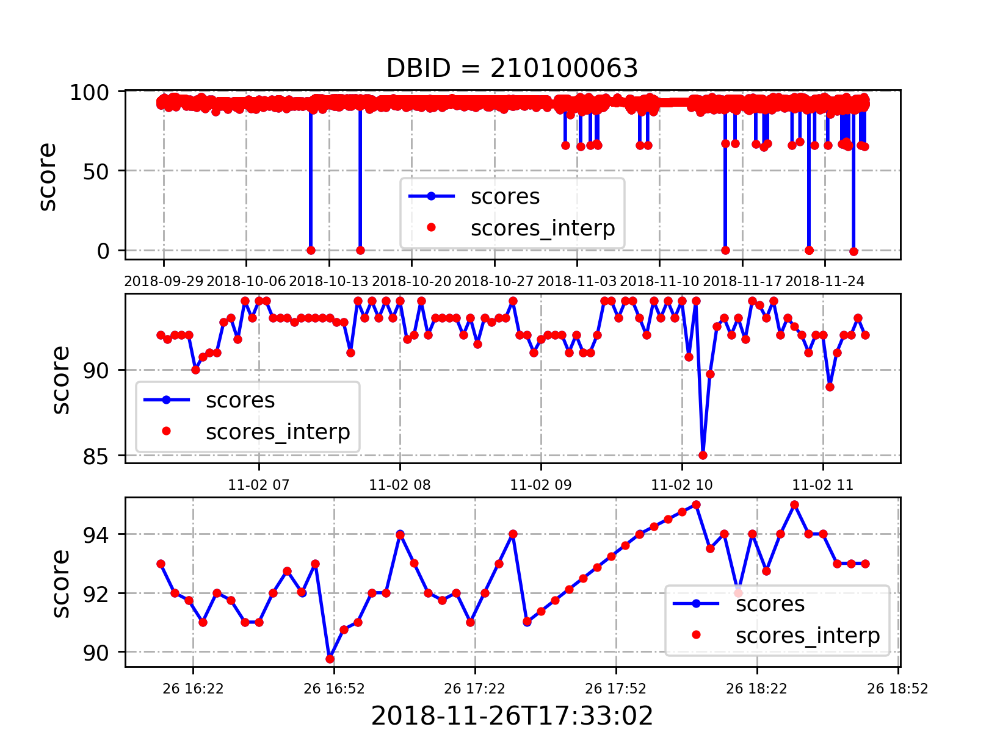

# myJan Overview

@wanchen from **Sep. 2018** to **Jan. 2019**
<br>work with ...</br>

**keys words:**
  - Operation for Data Base System
  - Multi-Step Forecasting
  - Correlation & (Pattern) Analysis (along with KPIs)

**Details:**

&emsp;&emsp;(NOTE: better given a framework of our model)


## 0. data/

#### 0.1 show data

Firstly, we show the target time series as following.

    

&emsp;&emsp;**0.1.1 score** (2018-09-29 to 2018-11-24) `AlignBuild` and `ShowData` in `BuildData.py`.



&emsp;&emsp;**0.1.2 58 KPIs** `ShowFigs` in `BuildData.py`.



&emsp;&emsp;Here, we try to find meanings behind the <u>58 KPIs</u>.
```python
['2180200', '2180501', '2180507', '2180508', '2180509', '2180513',
'2180514', '2184301', '2184302', '2184303', '2184305', '2184306',
'2184312', '2184313', '2184314', '2184315', '2184316', '2184317',
'2184318', '2184319', '2184322', '2184323', '2189000', '2189001',
'2189002', '2189003', '2189004', '2189006', '2189008', '2189010',
'2189016', '2189018', '2189026', '2189030', '2189044', '2189046',
'2189055', '2189058', '2189092', '2189100', '2189106', '2189108',
'2189112', '2189118', '2189119', '2189121', '2189123', '2189144',
'2189147', '2189159', '2189999', '2190054', '3000003', '3000005',
'3000006', '3000007', '3000008', '3000200']
```
&emsp;&emsp;{ According to the file `os` sheetlet in `采集id.xlsx`, we figure out that
  - `3000003`, `failed_ping`, `带内带外能ping通，账号密码也对就是连接不上`
  - `3000005`, `Mem_used`, `内存使用率`
  - `3000006`, `fss_used`, `文件系统使用率`
  - `3000007`, `RXawait`, `Io读写延时`
  - `3000008`, `MemFree`, `物理内存剩余量`
  - `3000200`, `RX_ERR_DRP`, `总报错率`

&emsp;&emsp;} <u>It is very different here.</u>

&emsp;&emsp;The whole information of KPIs meanings can be found in [`data/data-1544602176927.csv`](data/data-1544602176927.csv). Actually, there are totally **276 different kinds of KPIs**.
  - `...`
  - `3000003`, `CPU used`, `CPU使用率`
  - `3000004`, `Mem used`, `内存使用率`
  - `3000005`, `root fss usage`, `根目录文件系统使用率`
  - `3000006`, `IO Latency`, `Io读写延时 RXawaite`
  - `3000007`, `Mem Free (kb)`, `物理内存剩余量(kb)`
  - `3000008`, `Ioawait`, `WIO占CPU百分比`
  - `...`

&emsp;&emsp;We call KPIs as `KPIs-1`, `KPIs-2`, ... , `KPIs-276` while a data set of one certain DBID doesn't have all 276 KPIs. `fetchKPIs276` in `BuildData.py`


#### 0.2 interpolation & alignment

&emsp;&emsp;As expected, `scores` and `KPIs` are sampled every 3 minutes while some `shifts` and `missing values` occur sometime. We call it `interpolation & alignment task`, which `deal with the discontinuity`.

&emsp;&emsp;We adopt `interp1d` in scipy.

```python
from scipy.interpolate import interp1d
'''
interp1d(x, y, kind)
'''
t_raw = [1, 4, 8, 12]
t_new = np.linspace(1, 12, 3)

func = interp1d(t_raw, y_raw, kind)
y_new = func(t_new)

```
**NOTES:**
  - the format of one iterm is `timestamp + score + KPIs`, so we can check the discontinuity of timestamp.
  - **Firstly,** we delete the item whose score is **0.0** representing that the system cannot be reached and the KPIs are **NULL** at the same time.
  - **Secondly,** (move the timestamp like `2017-11-27T12:15:06` to `2017-11-27T12:15:00`) Acutually, we can ignore that.
  - **Thirdly,** if the time-nearby pairwise `t2-t1>(3+1)minutes`, we choose to set a seperator here which means they are seperated into different subsequences.


&emsp;&emsp;**0.2.1 score** `AlignBuild_v2` and `ShowData_v2` in `BuildData.py`.




&emsp;&emsp;**0.2.2 58 KPIs**

&emsp;&emsp;The processing details are given as following.
  - fetch raw data from `data/210100063/all.csv`
  - `interpolation & alignment` on `score` and `58 KPIs`
  - results are saved as <u>`data/210100063/all_interp.csv`</u> (we save data as `np.float32` and it makes file bigger)


## 1. forecaster/

&emsp;&emsp;this fold is mainly for `Multi-Step Forecasting`.

#### 1.1 related works


#### 1.3 motivation
(**`seq2seq` Multi-step & Pattern in segmentation**)

(**time-frequency analysis & `wavelet` dec-rec**)


## 2. analyst/

&emsp;&emsp;this fold is mainly for `Pattern & KPIs Analysis`. <u>Actually, the Pattern in segmentation correspond with the System Condition.</u>

#### 2.1 Segmentation & Pattern
(NOTES: `Segmentation & Pattern` are implemented after `interpolation & alignment`)

&emsp;&emsp;**Attension:** For `DBID=210100063`, in the begining, we choose the data between `2018-11-12T15:51:00` and `2018-11-27T09:21:00` (before it there is along time without connection). The most important thing we must pay attention to is that our `interpolation & alignment` method adds one kind of pattern to the raw data (according to the figure `2018-11-26T17:33:02`).

&emsp;&emsp;**score:** The Analysing details are shown in `analyst/readme.md`.

&emsp;&emsp;**58 KPIs:** The Analysing details are shown in `analyst/readme.md`.


#### 2.2 Importance Analysis (simple idea)

#### 2.3 Rule Analysis (advanced idea)
&emsp;&emsp;To find how various KPIs affect the System Condition, we define the problem as `Rule Learning` which can mine the rules as following.

 S_k $$" style="border:none;">

n-th KPI's i-th Pattern and ... and m-th KPI's j-th Pattern might cause the System's k-th Pattern.

---
#### END OF FILE
