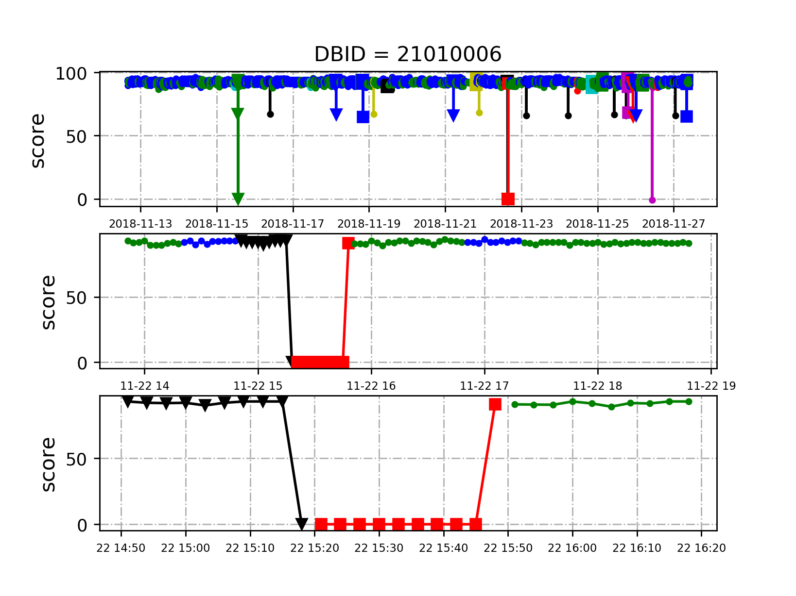
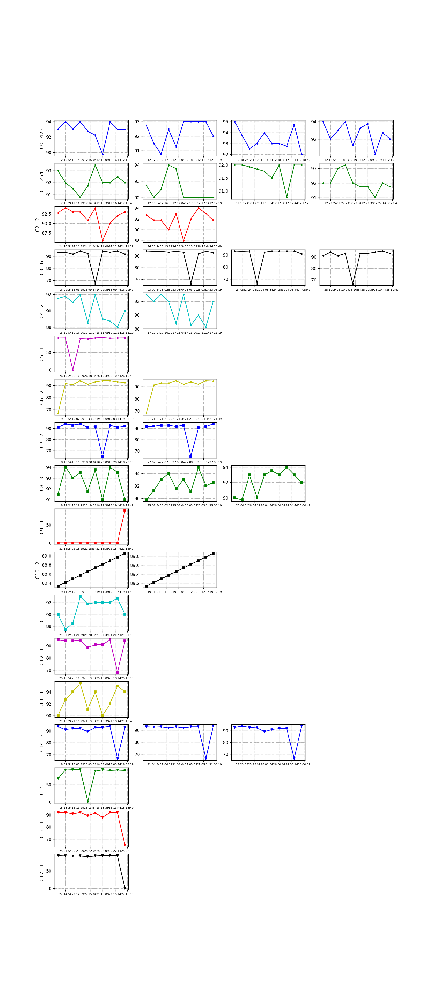
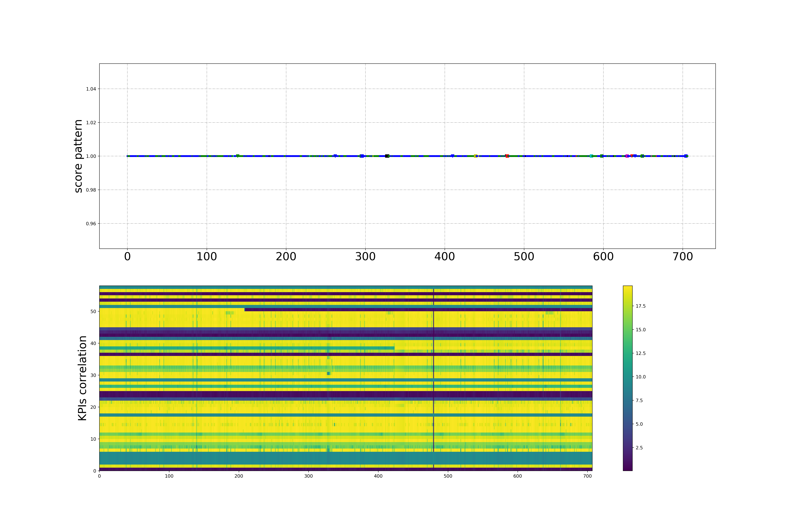

## 2. analyst


#### 2.1 Segmentation & Pattern

(**NOTES:** Currently, we cluster the segments from `score` time series, and then find the method to compute the correlation and estimate the importance between `score` and each KPI seperately. `List the Top ones factors` is our goal.)

&emsp;&emsp;**score:** `hierClust()` in `TSA_v1.py` saves the results as `` in
<u>`data/210100063/cluster_assigned_slct.npz`</u>
```python
np.savez_compressed(SavePath,
                    score_slct=score_slct,
                    times_slct=times_slct,
                    cluter_assigned_slct=cluter_assigned_slct)
```
visualization: `ShowClusterResults()` in `TSA_v1.py`



visualization: `ShowClusterResults()` in `TSA_v1.py`

&emsp;&emsp;**Discussion:** we have to explain the certain `Pattern` behind each kind of `Cluster`. Here, I have some ideas.
  - `C9=1: red square` and `C10=2: black square` are added patterns because of `interpolation & alignment` in `sec 0.2`.
  - `C3=6: black dot`, `C6=2: yelloe dot`, `C7=2: blue square`, `C12=1: purple square`, `C14=3: blue triangle`, `C16=1: red triangle` have similar shape but their valley's appearance vary in time.
  - `C0=423: blue dot`, `C1=254: green dot`, `C2=2: red dot`, `C4=2: indigo dot`, `C8=3: green square`, `C12=1: indigo square`, `C13=1: yellow square` are fluctuating between **85** and **95**
  - `C5=1: purple dot`, `C15=1: green triangle`, `C17=1: black triangle` witness sharp drop from **90+** to **0**. (Actually, the black triangle one is shown in the first figure)

#### 2.2 Segmentation & Correlation (Similarity)

(NOTES: Currently, we adopt `DTW` as `temporal similarity measurement` because of its optimal performance.)

(NOTES: fill `nan` with 0)

&emsp;&emsp;**58 KPIs:**
  - fetch raw data from `data/210100063/all_interp.csv`
  - compute the similarity in each segment corresponding with `score` as `correlation` and select the top X KPI for each segmentation interval.
  - `corKPIs_slct.npz`
```python
np.savez_compressed(SavePath, corKPIs_slct=corKPIs_slct, times_slct=times_slct)
```



we better zoom it and draw another one.


---
_END OF FILE_
